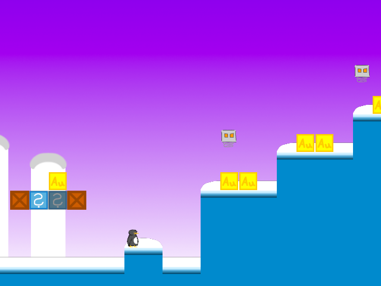

# SuperTux v0.1.3 Level Player

https://user-images.githubusercontent.com/57591392/137566427-165d9aca-c52b-4f39-8d5c-ec266b4f1c79.mov

## Introduction

The goal of the SuperTux v0.1.3 Level Player project is to produce an unofficial standalone Linux program that can read and play preexisting SuperTux v0.1.3 level files.

## Quick Start

Run `./build.sh` to build. The single executable program emitted is the SuperTux v0.1.3 Level player.

## How to Play

Use WASD or arrow keys to move. Holding CTRL allows stunned ice cubes to be picked up. Press q to quit the game.

The objective of the game is to make it to the goal at the end of each (side-scrolling) level.

Some enemies will die when jumped upon.

## Development

See [README-dev.md](/README-dev.md) for details.

## Licensing

All code in this repository, with the exception of the contents of the `gpl/` directory, belongs to the public domain under The Unlicense software license. The `gpl/` contents are licensed under the GNU GPL v2 and come from the original GPL-licensed SuperTux v0.1.3 game project.
