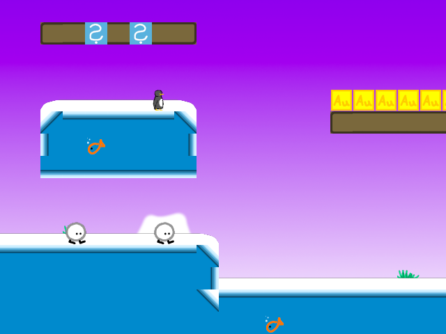

# SuperTux v0.1.3 Level Player

## Introduction

The goal of the SuperTux v0.1.3 Level Player project is to produce an unofficial standalone Linux program that can read and play preexisting SuperTux v0.1.3 level files. This player is currently under heavy development.

## Quick Start

Run `./build.sh` to build. The single executable program emitted is the SuperTux v0.1.3 Level player.

## Development

- build.sh: Build script.
- initgl.c, initgl.h: Initialize a GLES2 context via EGL and Xlib. Call core() with keystroke data.
- std.h: Standard library includes.
- util.c, util.h: Utility functions.
- levelreader.c: Parser for STL files. Entry point is `levelReader()` which returns a `struct stl` representing the parsed level. The returned struct has `lvl.hdr` set if parsing was successful, cleared otherwise.
- stlplayer.c, stlplayer.h: Main program file.

- gpl/: GPL-licensed data. Contains the original SuperTux v0.1.3 level definitions.
- shaders/: OpenGLES 2 shaders.
- textures/: Textures for painting in the level. Each file is 64x64 texels of RGB bytes.

The static tiles (i.e., not the objects) in the interactive-tm layer of the level are recognized in `maybeInitgTextureNames()` and `loadLevelInteractives()`. Adding recognition for a tile type requires modifying both functions to ensure that the static tile is both drawn and interactive (as a worldItem).

New badguys can be registered at `loadLevelObjects()` and `fnpl()` so that they are loaded into the game and can interact with Tux, respectively. The callback for `worldItem_new()` can be used to help implement the badguy behavior in-game.

In a WorldItem callback, setting a WorldItem type to STL_DEAD allows it to be cleaned up by the function that runs the WorldItem callbacks. See the `applyFrame()` implementation for more details.

Register new levels by editing `gCurrLevel` and `reloadLevel()`.

## Licensing

All code in this repository, with the exception of the contents of the `gpl/` directory, belongs to the public domain under The Unlicense software license. The `gpl/` contents are licensed under the GNU GPL v2 and come from the original GPL-licensed SuperTux v0.1.3 game project.
